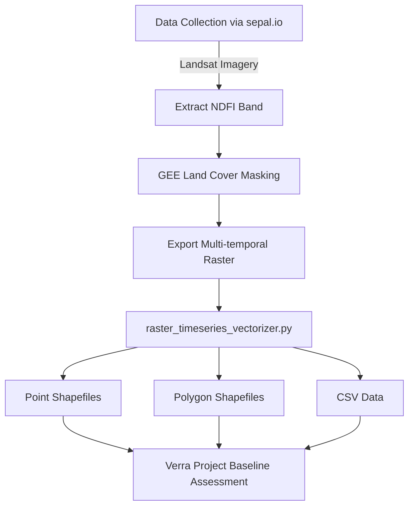

# Temporal Land Cover Vectorizer

## Overview
This repository contains tools and scripts for processing and analyzing temporal land cover changes using SEPAL.io, Google Earth Engine, and Python. The workflow supports baseline assessments for Verra carbon projects by processing NDFI (Normalized Difference Fraction Index) data across multiple time periods (2013-2023).

## Workflow Diagram

## Workflow Diagram


## Detailed Workflow
### 1. Data Collection (via SEPAL.io)
- Access to Landsat imagery through SEPAL platform
- Focused extraction of NDFI (Normalized Difference Fraction Index) band
- Provides pre-processed satellite imagery for analysis
- SEPAL.io simplifies access to Earth observation data

### 2. Land Cover Processing
- Extract NDFI band from Landsat imagery
  - NDFI is optimal for detecting forest degradation and vegetation changes
  - Helps identify bare soil and non-photosynthetic vegetation
- Apply GEE-based land cover masking for:
  - Shrubland
  - Grassland
  - Bare/Sparse Vegetation
- Export multi-temporal raster data (2013-2023)

### 3. Vector Conversion and Analysis
The `raster_timeseries_vectorizer.py` script processes the multi-temporal raster data:
- Input: Multi-band GeoTIFF with 6 temporal bands (2013-2023)
- Processing:
  - Converts masked raster data to vector formats
  - Maintains temporal information
  - Optimizes storage with integer-based values
- Outputs:
  - Point shapefiles (for precise location analysis)
  - Polygon shapefiles (for area analysis)
  - CSV files (for tabular analysis)

### 4. Baseline Assessment Support
Supports Verra project requirements through:
- Historical land cover change analysis
- Area calculations and quantification
- Temporal trend assessment
- Project validation documentation

## Repository Structure
### Recommended Structure
```text
temporal-landcover-vectorizer/
├── scripts/
│ ├── python/
│ │ ├── combine_rasters_colad.ipynb
│ │ ├── rename_raster_bands_2013_2023.ipynb
│ │ └── raster_timeseries_vectorizer.py
│ └── gee/
│ └── landcover_mask-js/
├── data/
│ ├── input/
│ │ └── raster/
│ └── output/
│ ├── raster/
│ ├── vector/
│ │ ├── points/
│ │ └── polygons/
│ └── csv/
├── docs/
│ └── workflow_documentation.md
└── README.md
```

### Directory Descriptions
- `scripts/`: Contains all processing scripts
  - `python/`: Python scripts and notebooks for data processing
    - `combine_rasters_colad.ipynb`: Notebook for combining raster data
    - `rename_raster_bands_2013_2023.ipynb`: Notebook for renaming temporal bands
    - `raster_timeseries_vectorizer.py`: Main script for converting raster to vector formats
  - `gee/`: Google Earth Engine scripts
    - `landcover_mask-js/`: JavaScript code for land cover masking in GEE
- `data/`: All data files
  - `input/raster/`: Source raster files from SEPAL.io
  - `output/`: Generated files
    - `raster/`: Processed raster files
    - `vector/`: Generated vector files (points and polygons)
    - `csv/`: Exported CSV data
- `docs/`: Documentation files

## Setup and Usage
### Prerequisites
- Google Earth Engine account
- SEPAL.io access
- Python 3.x
- Required Python packages:
  - GDAL
  - OGR
  - pandas

### Installation
1. Clone this repository:
bash
git clone https://github.com/ulfboge/temporal-landcover-vectorizer.git
cd temporal-landcover-vectorizer

2. Install required Python packages:
bash
pip install -r requirements.txt

### Usage
1. Collect Landsat imagery and NDFI band via SEPAL.io
2. Process land cover masking in Google Earth Engine
3. Run the vectorization script:
bash
python scripts/python/raster_timeseries_vectorizer.py

## Output Structure
The vectorization script generates:
- Point shapefiles: `output/vector/points/`
- Polygon shapefiles: `output/vector/polygons/`
- CSV files: `output/csv/`
  - Raw data: `*_vectorized.csv`
  - Cleaned data: `*_vectorized_cleaned.csv`

## Contributing
1. Fork the repository
2. Create your feature branch
3. Commit your changes
4. Push to the branch
5. Create a new Pull Request
